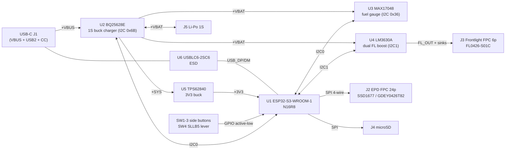
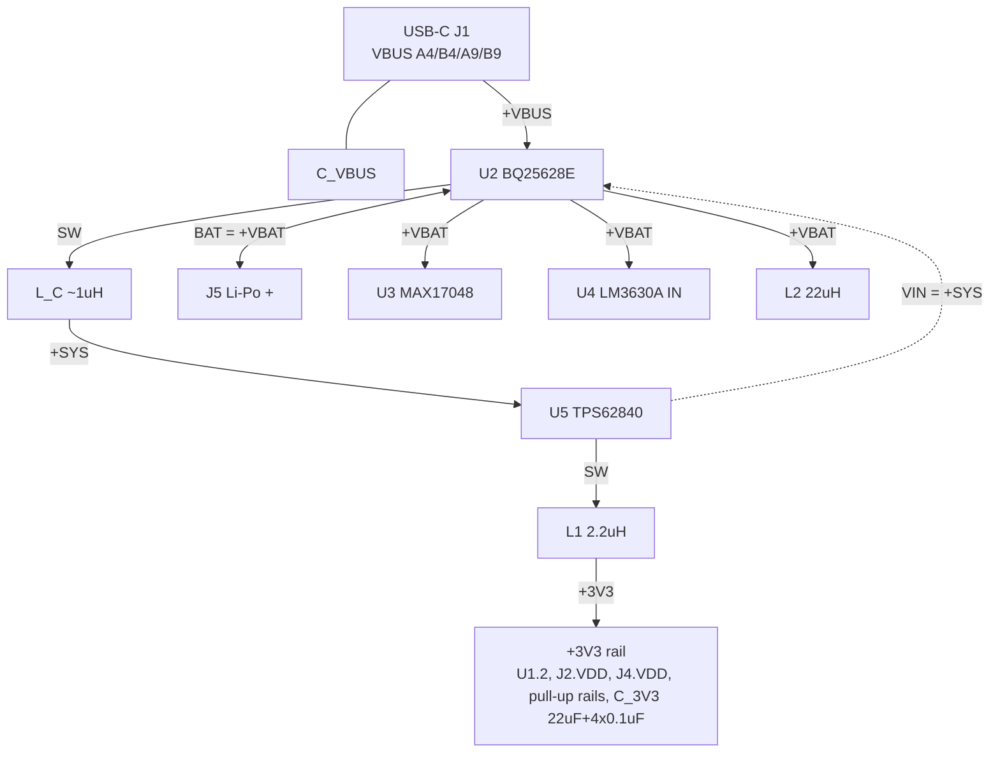
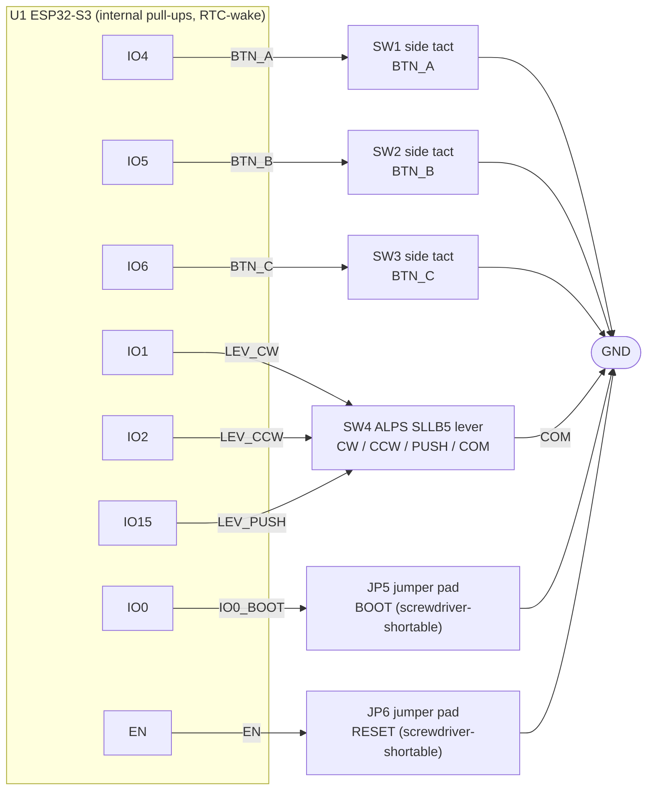
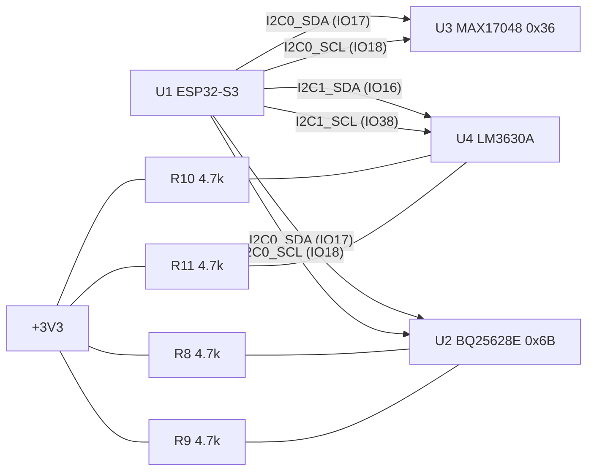
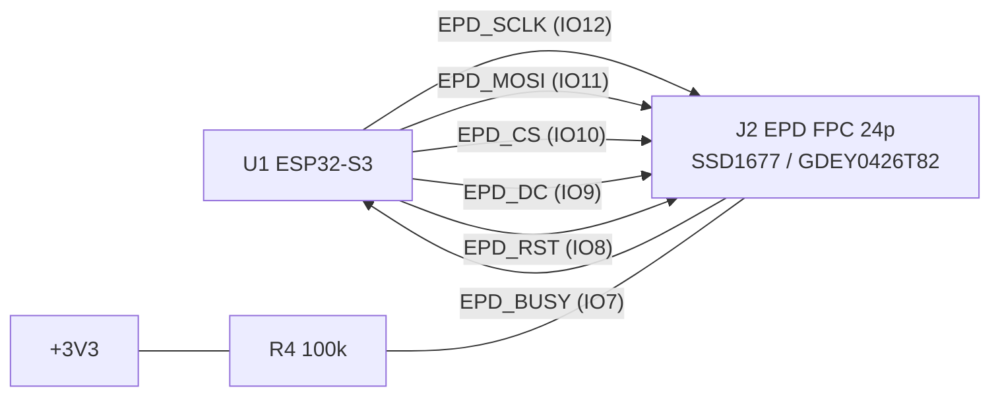
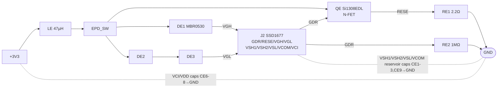
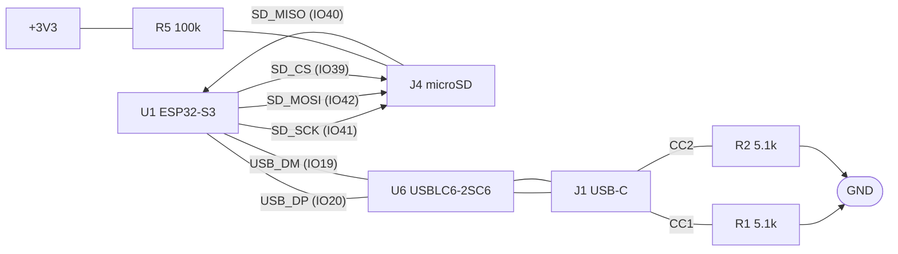
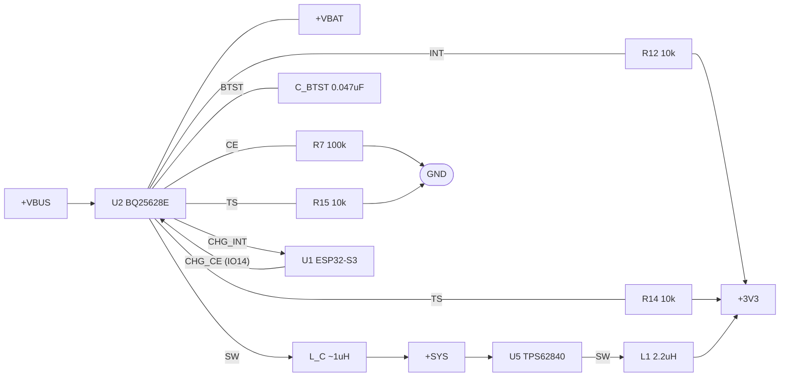
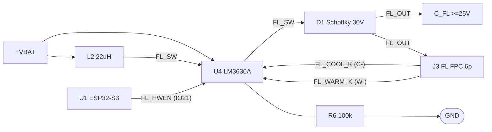

# Mini E-Reader — Schematic (subsystem view)

> **Why this file exists / why there is no `.kicad_sch`.** This board was captured
> **netlist-first**: the electrical design lives in
> [`ereader-connection-list.md`](./ereader-connection-list.md) (source of truth) →
> [`ereader-kicad.net`](./ereader-kicad.net) (netlist) → [`ereader.kicad_pcb`](./ereader.kicad_pcb)
> (placement). No schematic sheet was ever drawn, so KiCad's **Schematic Editor
> (Eeschema) has nothing to open** — that is the answer to "why is there no schematic".
>
> KiCad **cannot** auto-generate a schematic from a netlist or from the PCB (there is
> no netlist→schematic or PCB→schematic importer). A native `.kicad_sch` has to be
> *drawn* in Eeschema. The diagrams below are that schematic in reviewable form —
> they render directly on GitHub (Mermaid) and mirror the connection list net-for-net.
>
> **To get a native Eeschema schematic:** create a new schematic in the `ereader`
> project, drop the symbols for U1–U6 / J1–J5 / SW1–SW4 / JP5–JP6 / passives, and
> wire them to match these diagrams (label-based wiring is fine — same-named net
> labels connect). Run **ERC**, then it drives the same `ereader-kicad.net`.

All pin **numbers** on U1 are the exact ESP32‑S3‑WROOM‑1 datasheet pins; IC pins on
U2–U6 are by **function name** (remap to your chosen symbol's pads). Nets are taken
verbatim from the connection list.

---

## 1. System block diagram

---

## 2. Power tree

`GND`: U1.1/40/41(EPAD), U2 PGND/GND/EP, U3/U4/U5/U6 GND, J1 GND+shield, J2.VSS,
J4.VSS, J5.−, all cap returns, all pull-down / switch returns.

---

## 3. MCU GPIO map (U1 = ESP32‑S3‑WROOM‑1)

| Pin | GPIO | Net | Goes to |
|-----|------|-----|---------|
| 2 | 3V3 | +3V3 | supply |
| 1 / 40 / 41 | GND/EPAD | GND | ground |
| 3 | EN | EN | JP6 (RESET), R3 pull-up, C_EN |
| 27 | IO0 | IO0_BOOT | JP5 (BOOT) |
| 4 | IO4 | BTN_A | SW1.1 |
| 5 | IO5 | BTN_B | SW2.1 |
| 6 | IO6 | BTN_C | SW3.1 |
| 39 | IO1 | LEV_CW | SW4.CW |
| 38 | IO2 | LEV_CCW | SW4.CCW |
| 8 | IO15 | LEV_PUSH | SW4.PUSH |
| 10 | IO17 | I2C0_SDA | U2, U3, R8 |
| 11 | IO18 | I2C0_SCL | U2, U3, R9 |
| 9 | IO16 | I2C1_SDA | U4, R10 |
| 31 | IO38 | I2C1_SCL | U4, R11 |
| 20 | IO12 | EPD_SCLK | J2 |
| 19 | IO11 | EPD_MOSI | J2 |
| 18 | IO10 | EPD_CS | J2, R4 |
| 17 | IO9 | EPD_DC | J2 |
| 12 | IO8 | EPD_RST | J2 |
| 7 | IO7 | EPD_BUSY | J2 |
| 34 | IO41 | SD_SCK | J4 |
| 35 | IO42 | SD_MOSI | J4 |
| 33 | IO40 | SD_MISO | J4 |
| 32 | IO39 | SD_CS | J4, R5 |
| 14 | IO20 | USB_DP | U6, J1 |
| 13 | IO19 | USB_DM | U6, J1 |
| 24 | IO47 | CHG_INT | U2.INT, R12 |
| 22 | IO14 | CHG_CE | U2.CE, R7 |
| 23 | IO21 | FL_HWEN | U4.HWEN, R6 |

Strap/PSRAM/unused pins (IO3/13/45/46/35/36/37, RXD0/TXD0) → NC or test-point.

---

## 4. Navigation input (this is the input scheme from ADR 0008)

Nav contacts are **active-low momentary to GND** with the ESP32‑S3 **internal
pull-ups**; every one sits on an RTC‑capable GPIO so it can wake the MCU from deep
sleep. **SW1–SW3 are side-actuated (right-angle) tactiles** and **SW4 is the ALPS
SLLB5 two-way lever + push** — the actuators face the **board edge** because the
screen covers the whole front and magnets hold the back to the phone, so nothing
can be pressed from the top or bottom faces. **JP5/JP6 (BOOT/RESET) are not
switches** — they're bare exposed 2-pad jumpers, momentarily shorted with a
screwdriver tip or tweezers when you actually need to flash/recover the board;
they read open (floating high through the pull-up) in normal use, so there's no
switch part, cap, or accidental-press risk sitting on a rarely-used recovery path.

`R3` (100k) pulls **EN** up with `C_EN` (1µF) for a clean reset; BOOT uses the
module's internal strap pull-up.

---

## 5. I2C buses

U3 (fuel gauge) and U4 (frontlight) both answer at 0x36 — that clash is exactly why
U4 is on a **separate bus (I2C1)**.

---

## 6. E‑paper (SSD1677 @ J2, 4‑wire SPI)

`J2.BS1` tied **low** (→GND) for 4‑wire SPI.

### 6a. EPD external DC‑DC (SSD1677 boost + charge pumps)

The SSD1677 needs an external boost + charge‑pump for its ±20 V gate / ±15 V source
rails. Now captured as real parts (LE/QE/DE1‑3/RE1‑2/CE1‑9) feeding J2's support pins:

> ⚠ **VERIFY & COPY 1:1.** The diode/charge‑pump interconnect, diode **orientation**, and
> the J2 (GDEY0426T82) **FPC pin numbers** are a functional PLACEHOLDER — transcribe them
> exactly from the Good Display GDEY0426T82‑FL01C reference schematic ("ESP32 Sample Code"
> zip) and the panel datasheet before capture + route. Rail cap **values are
> non‑negotiable** (≥25 V). See `ereader-connection-list.md` → *EPD external DC‑DC*.

---

## 7. microSD (SPI @ J4) and USB‑C data

---

## 8. Charger (BQ25628E) + 3V3 buck (TPS62840)

`CE low = charge enabled`; R7→GND makes charge-on the power-up default, GPIO14 drives
high to hard-disable.

---

## 9. Frontlight boost (LM3630A → FL0426‑S01C, 4‑wire)

`FL_OUT` feeds both J3.1 (C+) and J3.5 (W+); LED1/LED2 sink the cool/warm banks;
`R6→GND` keeps the frontlight off by default until GPIO21 enables it.
